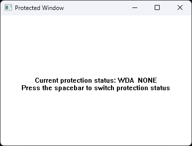
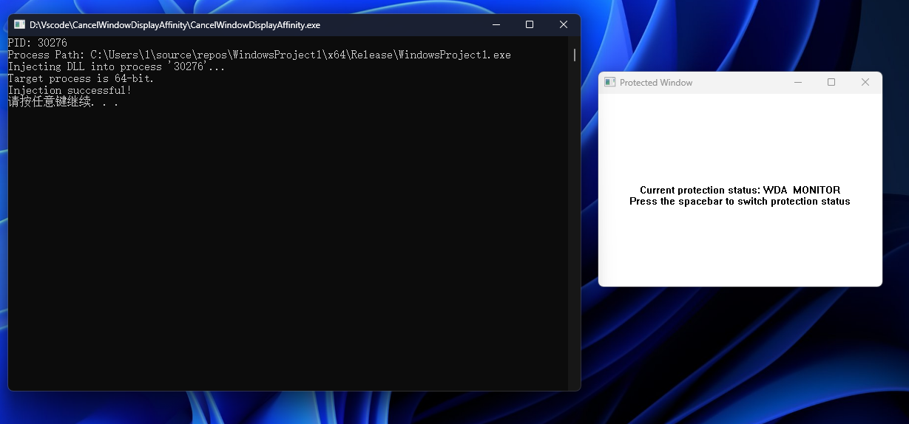

# CancelWindowDisplayAffinity

Remove `SetWindowDisplayAffinity` screen-capture protections via DLL injection.

## Single Binary Design

Everything compiles from **one source file** into **one executable**:

```
CancelWindowDisplayAffinity.cpp ──compile──> CancelWindowDisplayAffinity.exe
                                              ├─ embedded Affinity32.dll (resource)
                                              └─ embedded Affinity64.dll (resource)
```

- 32-bit and 64-bit DLLs are **embedded as Win32 resources** inside the EXE
- Extracted to `%TEMP%` at runtime, cleaned up on exit
- 64-bit targets: injected directly (same-arch `LoadLibraryA`)
- 32-bit targets: **cross-arch injection** by walking the target's PE export table to resolve 32-bit `LoadLibraryA`

## Build

### Quick Build (recommended)
```bat
build.bat
```
The script auto-detects Visual Studio via `vswhere`, compiles both DLLs, embeds them as resources, and produces a single EXE.

### Manual Build
From **x86 Native Tools Command Prompt**:
```bat
cl /nologo /DBUILD_DLL /LD /Fe:Affinity32.dll CancelWindowDisplayAffinity.cpp user32.lib
```
From **x64 Native Tools Command Prompt**:
```bat
cl /nologo /DBUILD_DLL /LD /Fe:Affinity64.dll CancelWindowDisplayAffinity.cpp user32.lib
rc /nologo payload.rc
cl /nologo /EHsc /Fe:CancelWindowDisplayAffinity.exe CancelWindowDisplayAffinity.cpp payload.res user32.lib psapi.lib advapi32.lib shell32.lib
```

### Source Files

| File | Purpose |
|------|---------|
| `CancelWindowDisplayAffinity.cpp` | Unified source (DLL + EXE via `#ifdef BUILD_DLL`) |
| `resource.h` | Resource IDs |
| `payload.rc` | Resource script (embeds DLLs) |
| `build.bat` | Automated build |

## Usage

1. Run `CancelWindowDisplayAffinity.exe` (auto-elevates to admin)
2. It automatically finds and patches all protected windows

## Example
### WDA_NONE:

### WDA_MONITOR:

### After injection:


## License

Provided as-is without warranty. Use at your own risk.
